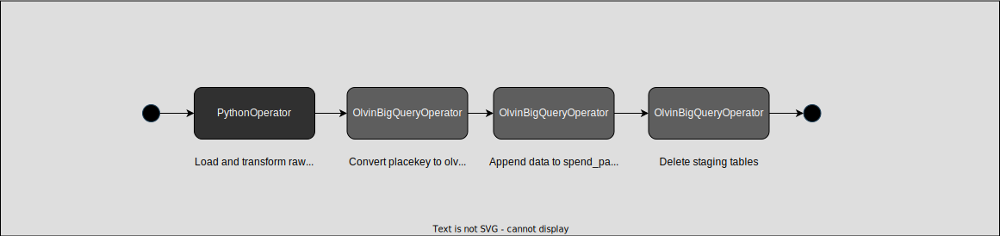

# SOURCES-RAW-SPEND-DATA-INGESTION

## Introduction
This DAG is designed to load the monthly Safegraph spend patterns data from GCS and update `sg_places_staging.spend_patterns` with the latest spend patterns data.

## Contents
- [SOURCES-RAW-SPEND-DATA-INGESTION](#sources-raw-spend-data-ingestion)
  - [Introduction](#introduction)
  - [Contents](#contents)
  - [Prerequisites](#prerequisites)
  - [DAG Structure](#dag-structure)
  - [Usage](#usage)
  - [Configuration](#configuration)
  - [Troubleshooting](#troubleshooting)
  - [Changelog](#changelog)
    - [\[1.0.0\] - 2024-01-23](#100---2024-01-23)
  - [References](#references)

## Prerequisites
- No extra packages are required for running this DAG.

## DAG Structure

## Usage
- This DAG is scheduled to run on the 21st of the month.

## Configuration
- This DAG uses a local `config.yaml` file and the Airflow variables.

## Troubleshooting
- No known issues currently.

## Changelog
### [1.0.0] - 2024-01-23
- :tada: DAG documented - [@jake-olvin](https://github.com/jake-olvin)

## References
- [GitHub Link](https://github.com/olvin-com/airflow-dags/tree/main/dags/sources-raw-spend-data-ingestion)
- [Confluence Documentation](https://passby.atlassian.net/wiki/spaces/OLVIN/pages/2116517889/Spend+data)
- [Safegraph Documentation](https://docs.safegraph.com/docs)