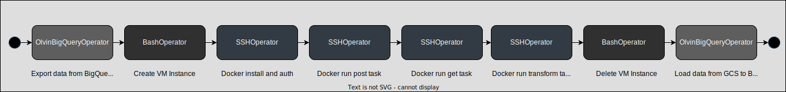

# DataForSEO Reviews DAG

## Introduction
This DAG is designed to fetch and manage Google Reviews data using the DataForSEO API, streamlining the process of retrieving Google Reviews data by automating API requests and storing the results in a structured and accessible manner.

## Contents
- [DataForSEO Reviews DAG](#dataforseo-reviews-dag)
  - [Introduction](#introduction)
  - [Contents](#contents)
  - [Prerequisites](#prerequisites)
  - [DAG Structure](#dag-structure)
  - [Usage](#usage)
  - [Configuration](#configuration)
  - [Troubleshooting](#troubleshooting)
  - [Changelog](#changelog)
    - [\[1.0.0\] - 2023-10-30](#100---2023-10-30)
    - [\[1.0.1\] - 2023-11-06](#101---2023-11-06)
  - [References](#references)

## Prerequisites
- This DAG runs the latest version of the `europe-west1-docker.pkg.dev/storage-prod-olvin-com/pby-source-p-ary-euwe1-apis/dataforseo` image, ensure the image is up to date before triggering.
- No extra packages are required for running this DAG.

## DAG Structure

## Usage
- This DAG is not scheduled and should be triggered manually to run.

## Configuration
- This dag uses the global `config.yaml` file and the Airflow Variables.
- Arguments `batch-number`, `batch-size`, and `trigger` must be passed to the config when triggering the DAG:
  - `batch-number`: unique `int`` to identify the group of POIs.
  - `batch-size`: quantity (`int`) of POIs to process in a batch.
  - `trigger`: method of DAG trigger (`full` or `partial`)

## Troubleshooting
- No known issues.

## Changelog
### [1.0.0] - 2023-10-30
- :tada: DAG created - [@jake-olvin](https://github.com/jake-olvin)
### [1.0.1] - 2023-11-06
- :bricks: DAG modified to handle executing in batches - [@jake-olvin](https://github.com/jake-olvin)
- :ladder: Add `batch-number` and `batch-size` args to control data size - [@jake-olvin](https://github.com/jake-olvin)
- :deciduous_tree: Add `trigger` arg for data-prep branch for `full` or `partial` trigger - [@jake-olvin](https://github.com/jake-olvin)
- :fire: Add static_feature table queries - [@jake-olvin](https://github.com/jake-olvin)
- :zero: zero-pad batch-number in filesystem - [@jake-olvin](https://github.com/jake-olvin)

## References
- [pby-source-apis-dataforseo Repository](https://github.com/olvin-com/pby-source-apis-dataforseo)
- [Confluence Documentation](https://olvin.atlassian.net/wiki/spaces/OLVIN/pages/2317811728/DataForSEO)
- [DataForSEO API Dashboard](https://app.dataforseo.com/api-dashboard)
- [DataForSEO Google Reviews API Documentation](https://docs.dataforseo.com/v3/business_data/google/overview/?python)
- [DataForSEO Google Reviews API Pricing](https://dataforseo.com/pricing/business-data/google-reviews-api)