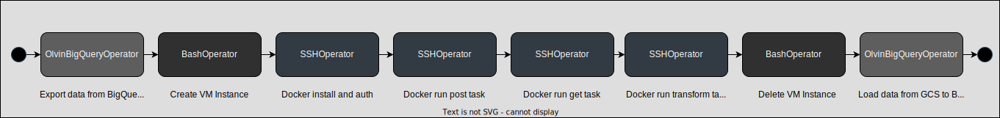

# DataForSEO Trends DAG

## Introduction
This DAG is designed to fetch and manage Google Trends data using the DataForSEO API, streamlining the process of retrieving Google Trends data by automating API requests and storing the results in a structured and accessible manner.

## Contents
- [DataForSEO Trends DAG](#dataforseo-trends-dag)
  - [Introduction](#introduction)
  - [Contents](#contents)
  - [Prerequisites](#prerequisites)
  - [DAG Structure](#dag-structure)
  - [Usage](#usage)
  - [Configuration](#configuration)
  - [Troubleshooting](#troubleshooting)
  - [Changelog](#changelog)
    - [\[1.0.0\] - 2023-10-13](#100---2023-10-13)
  - [References](#references)

## Prerequisites
- This DAG runs the latest version of the `europe-west1-docker.pkg.dev/storage-prod-olvin-com/pby-source-p-ary-euwe1-apis/dataforseo` image, ensure the image is up to date before triggering.
- No extra packages are required for running this DAG.

## DAG Structure

## Usage
- This DAG is not scheduled and should be triggered manually to run.

## Configuration
- This dag uses the global `config.yaml` file and the Airflow Variables.

## Troubleshooting
- No known issues.

## Changelog
### [1.0.0] - 2023-10-13
- DAG created :tada:

## References
- [pby-source-apis-dataforseo Repository](https://github.com/olvin-com/pby-source-apis-dataforseo)
- [Confluence Documentation](https://olvin.atlassian.net/wiki/spaces/OLVIN/pages/2317811728/DataForSEO)
- [DataForSEO API Dashboard](https://app.dataforseo.com/api-dashboard)
- [DataForSEO Google Trends API Documentation](https://docs.dataforseo.com/v3/keywords_data/google_trends/overview/?python)
- [DataForSEO Google Trends API Pricing](https://dataforseo.com/pricing/keywords-data/google-trends)